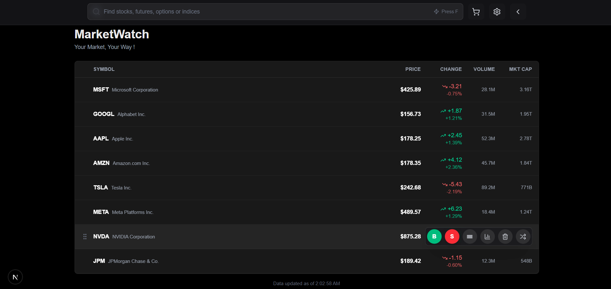

📈 MarketWatch
A slick, drag-and-drop stock tracker.

🚀 Setup
bash# Install dependencies
npm install

# Run the dev server
npm run dev
Open http://localhost:3000 and you're golden.

🎯 The Approach

What it does

Drag & Drop Reordering: Grab stocks by the grip icon and rearrange them however you want
Quick Actions on Hover: Buy/Sell/Delete buttons appear when you hover over a stock 
Keyboard Shortcuts: Press F to jump straight to search 
Real-time Filtering: Search by symbol or company name
Responsive Design: Works on mobile, tablet, desktop 

Tech Stack

Next.js 14 with App Router 
React for the component stuff
TypeScript 
Tailwind CSS for styling
Lucide Icons for the pretty icons

Design Choices

Dark theme only
Glassmorphism
Minimal state management

Code Structure

Single component file 
Inline state management
TypeScript interfaces for the stock data so we know what we're working with
Hover states handled with local component state for better performance

 Features

✅ Smooth drag-and-drop reordering
✅ Hover-activated action buttons (Buy, Sell, Chart, Delete, etc.)
✅ Live search with instant filtering
✅ Keyboard shortcut (F) for search focus
✅ Color-coded gains/losses (green good, red bad)
✅ Responsive layout that adapts to screen size
✅ Sticky header because scrolling shouldn't make you lose context